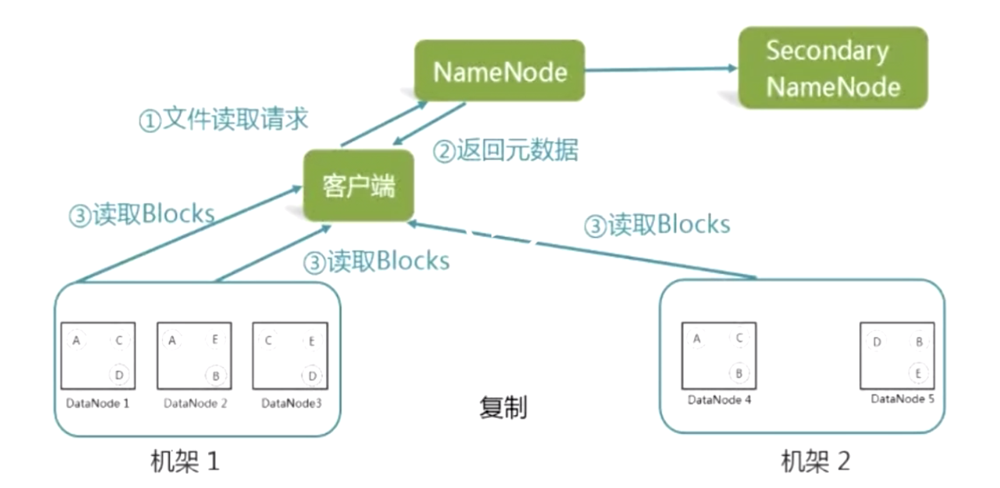
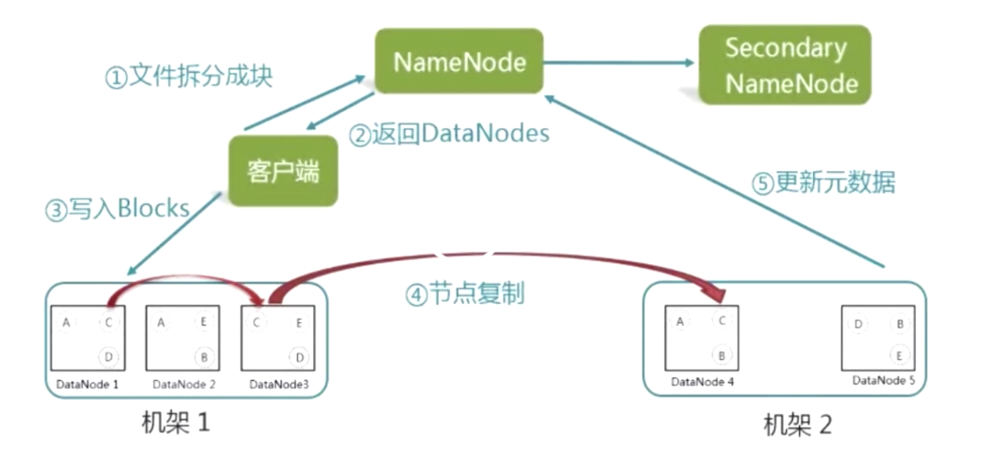
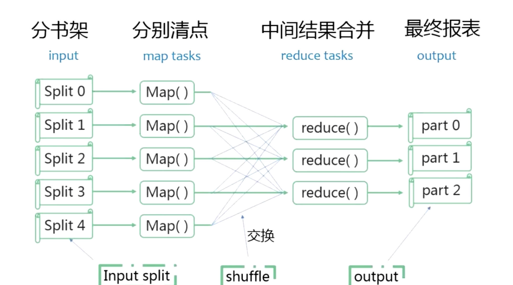
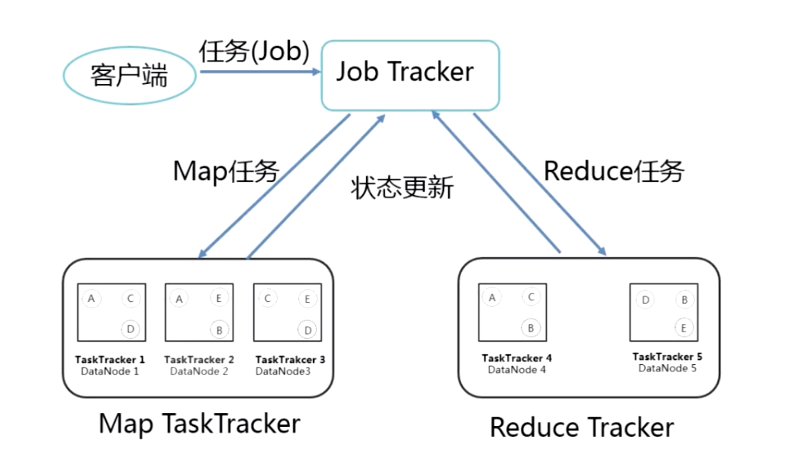
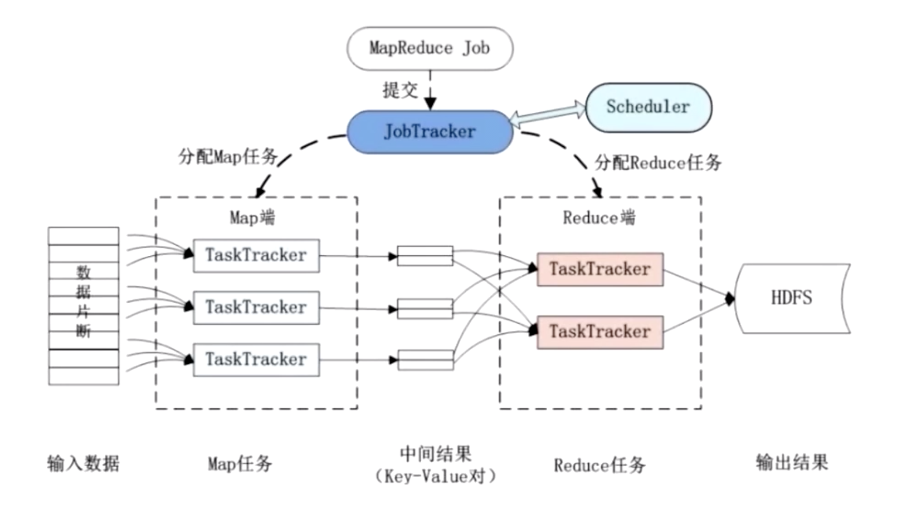
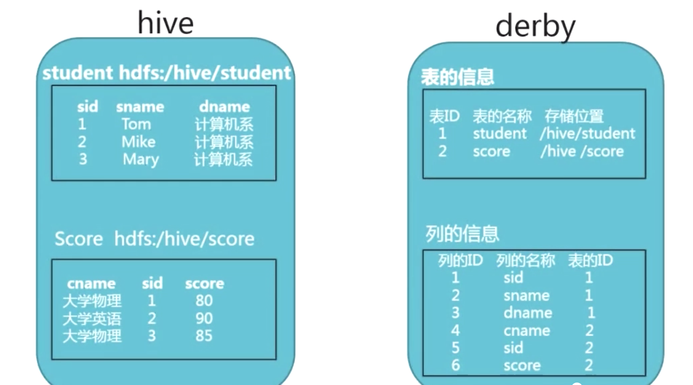

# 1.1.2 Hadoop产生的历史

+ 为了处理海量数据：

  **GFS**（分布式文件系统）+**MapReduce**（分布式计算架构）+**BigTable**（分布式数据库）

# 1.1.3 Hadoop基础概念

+ Hadoop是什么

  主要是分布式存储+分布式计算平台

+ Hadoop组成

  HDFS：分布式文件系统

  MapReduce：并行处理框架，实现任务分解和调度

+ Hadoop拥有海量开源工具支持

  Hive：编写SQL，自动转换成Hadoop任务，不需操心Hadoop任务的分解和调度。

  Hbase：存储结构化数据的分布式数据库。数据随机读写和实时访问。

  + Hbase与传统数据库的区别：放弃了事务特性，追求更高的扩展性。

  ZooKeeper：监控集群每一个节点的状态。

# 1.2.1 HDFS基本概念

+ 三个基本概念

   + Block（块）

     文件分块存储，默认块大小64MB，块石文件存储处理的逻辑单元

  + NameNode

    管理节点，存放元数据（文件与数据块的映射表、数据块与数据节点的映射表）

  + DataNode

    工作节点，存放数据块

# 1.2.2 HDFS的主要特点

+ 数据冗余机制

  一个数据块，三个副本（存储数据块的机架上有两个，另一个机架上有一个）

+ 数据一致性保证

  心跳检测：DataNode每隔一段时间，向NameNode发送心跳协议，NameNode依次判断节点是否为active状态。

+ 主节点备份

  二级NameNode：元数据定期更新到二级NameNode。

+ 读取文件步骤

  

+ 写入文件步骤

  

+ HDFS特点：数据冗余，硬件容错；流式的数据访问（数据写入后无法修改，只能删除原有数据块，重新写）；

+ 适用性、局限性

  	+ 适合数据批量读写，吞吐量高
  	+ 不适合交互式应用，低延迟很难满足
  	+ 适合一次写入多次读取，顺序读写
  	+ 不支持多用户并发写相同文件

# 1.2.3 HDFS的文件读写操作

+ HDFS命令行操作

  格式：hadoop fs -<命令> <目标>

+ 指令

  	+ hdfs version
  	+ hdfs dfsadmin -report（运行状况）
  	+ hadoop fs -ls /（查看目录）
  	+ hadoop fs -mkdir /input
  	+ hadoop fs -rm /input -r
  	+ hadoop fs -put <本地文件> <远端目录>（上传文件）
  	+ hadoop fs -get <远端目录>（下载文件）
  	+ hadoop fs -cat /input/test.txt（打印文本内容）

# 1.3.1 MapReduce的原理

+ 原理：大任务分成小任务（Map），并行执行后合并结果（Reduce）。

+ 过程：将输入的数据分成多个子任务，一个节点负责一个子任务，子任务执行完交给负责汇总节点来合并结果。

  

# 1.3.2 MapReduce运行流程

+ Job&Task

  + JobTracker

    一个job：找出博客中访问量最多的IP

  + TaskTracker

    一个job要分成多个task完成，包括多个map task和多个reduce task

+ Job&Task工作流程

  jobTracker监管Job队列，JobTracker调用Map()将Job分成多个Task，交给taskTracker管理。

  taskTracker与要处理的数据处于相同DataNode，实现了跟着数据走的原则。

  

+ JobTracker工作角色

  	+ 作业调度
  	+ 分配任务、监控任务执行进度
  	+ 监控TaskTracker的状态

+ TaskTracker工作角色

  	+ 执行任务
  	+ 向JobTracker汇报状态

+ MR作业流程

  

+ MR容错机制

  	+ 重复执行（Job失败后再执行一次）
  	+ 推测执行（某一个task执行很慢，会新建一个相同task，只要两个task中有一个完成，就把另一个task终止）

# 2.1.1 数据仓库Hive

+ 概述
  	+ 是一个工具
  	+ 用来构建数据仓库
  	+ 具有类似于SQL的操作语句HQL
+ Hive构建的数据仓库本质上就是数据库，数据存储与HDFS上，适合延迟要求不高的离线计算任务。

# 2.1.2 数据仓库

+ 数据仓库建立过程

  

  数据仓库引擎说白了就是通过函数调用仓库里的数据，一堆函数封装在一起，叫做引擎。

+ OLTP

  联机事务处理（同时成功，一个失败整个任务都失败）

+ OLAP

  联机分析处理（用于查询，不做更新）

+ 星型模型和雪花模型

  	+ 以商品信息为中心，它与客户信息、厂家信息有关联。这形成了型模型。

  	+ 以厂家信息为中心，又会有很多相关信息。多个中心形成了雪花模型。

# 2.1.3 什么是Hive

+ 传统的数据仓库，如oracle构建的数据仓库将数据存储在oracle数据库。Hive构建的数据仓库将数据存储在Hadoop HDFS上。
+ Hive可以进行ETL操作（数据抽取、转化、加载）
+ 提供HQL语言（类似SQL）
+ Hive允许自定mapper和reducer完成复杂的分析工作
+ Hive有SQL解析引擎，将SQL转换成MR作业，然后在Hadoop执行
+ Hive的表其实是HDFS的目录，表中的数据其实是目录下的文件。

# 2.2.1 Hive的体系结构之元数据

+ Hive的元数据存储在数据库中（mysql/derby/oracle），元数据包括表名、表列和分区及其属性、表属性、表数据所在目录灯

  

# 2.2.2 Hive的体系结构之HQL执行过程

