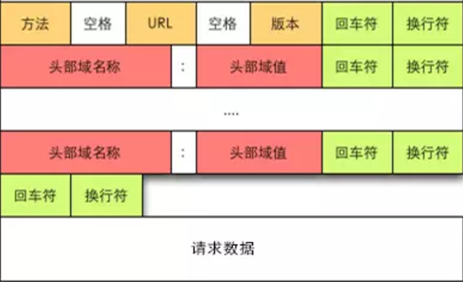

# HTTP报文

HTTP报文分为**请求报文**和**响应报文**

### 一、请求报文

#### 1.报文组成部分

+ 请求行
+ 请求头
+ 空行
+ 请求体

请求报文结构如图所示



请求报文示例

```
POST /db/ HTTP/1.1
Accept-Encoding: identity
Content-Length: 69322
Host: localhost:5001
Content-Type: multipart/form-data; boundary=192.168.1.28.1000.29856.1581697142.348.3
Connection: close
User-Agent: Python-urllib/2.7

--192.168.1.28.1000.29856.1581697142.348.3
Content-Disposition: form-data; name="detect_type"

1
--192.168.1.28.1000.29856.1581697142.348.3
Content-Disposition: form-data; name="image" filename="a.jpg"
Content-Type: image/jpeg

# 省略二进制字节流
--192.168.1.28.1000.29856.1581697142.348.3
```


#### 2.报文组成详解

##### 2.1.请求行

格式：[Method] [Request URI] [HTTP Version] [换行符]

示例："POST /db/ HTTP/1.1"

##### 2.2.请求头

接收方需要知道发送方的请求信息以及所传输资源的信息，这些信息都包含在请求头中。

用以描述发送方请求信息的常用头字段

+ Host
+ User-Agent
+ Accept
+ Accept-Encoding
+ Accept-Language
+ Connection
+ Transfer-Encoding

请求头中有一部分头字段，用以描述请求报文中所携带的资源信息，称为**实体头**

+ Content-Type
+ Content-Length
+ Content-Language
+ Content-Encoding
+ Last-Modified
+ Expires

##### 2.3.空行

一般采用\r\n

##### 2.4.请求体

请求体一般用于POST请求， 真正要传输的数据包含在请求体中，数据类型可以是文本、图像、声音、附件。传输的数据类型将体现在实体头的Content-Type。

普通文本传输，Content-Type为application/x-www-form-urlencoded。

报文中若包含文件，Content-Type为multipart/form-data，且还需要指明内容分隔符boundary。如：

```
Content-Type: multipart/form-data; boundary=192.168.1.28.1000.29856.1581697142.348.3
```

*Tips*

*POST提交的表单数据，可以为键值对或文件，且一个表单允许提交多个标签，boundary正是用于分隔不同标签的。不同标签之间用一个boundary分隔。*

### 二、响应报文

