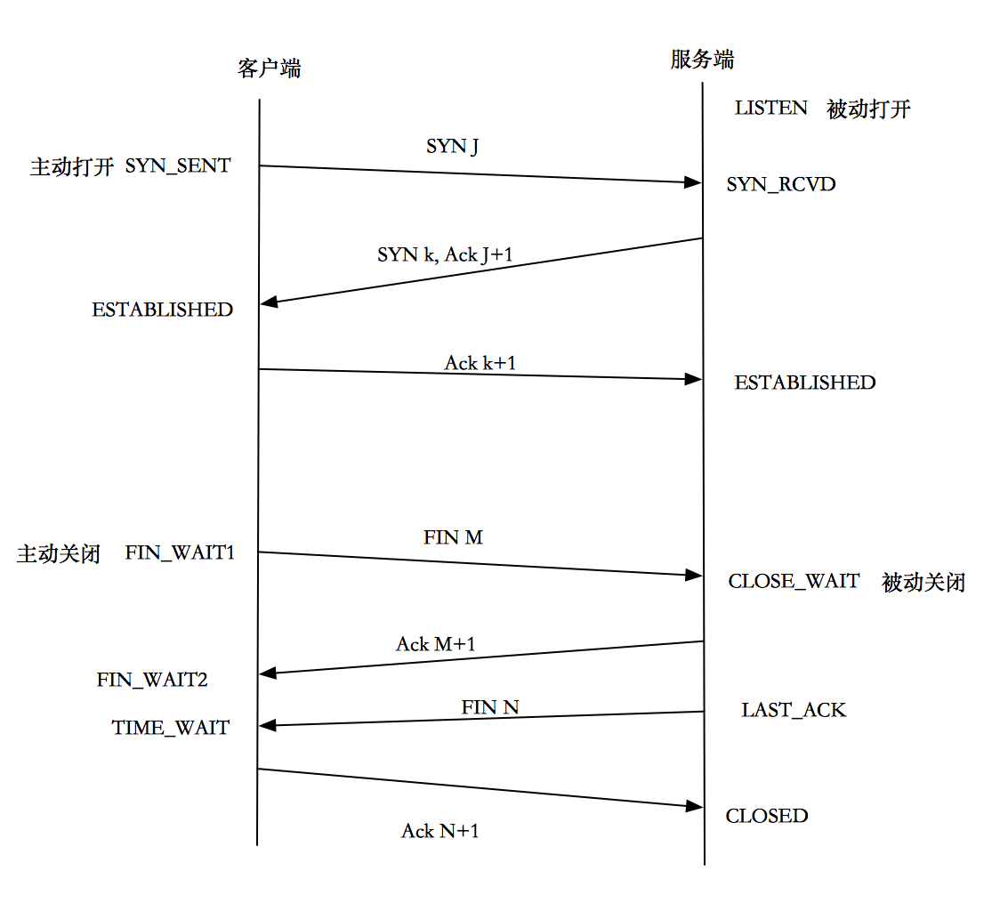

# ISSUE: CLOSE_WAIT

## 导读

### 一、四次挥手

CLOSE_WAIT是四次挥手模型中的状态，模型如图所示：

*参考：[四次挥手过程][1]*

理解要点：

+ TCP是全双工模式，即发送数据的同时也能接收数据。
+ TCP连接的两端都可以主动发起关闭请求。

### 二、CLOSE_WAIT问题

CLOSE_WAIT发生在被动关闭端，通常该状态维持的时间非常短，甚至捕捉不到。出现CLOSE_WAIT本身是正常现象，但如果有大量的进程处于CLOSE_WAIT，则说明出问题了，产生的原因有：

1. 主动关闭端因为超时（可能是没收到第二次或第三次挥手消息），断开了socket连接。被动端的FIN（第三次挥手）因为socket的断开而无法发送，导致一直处于CLOSE_WAIT。
2. 被动端在发送ACK后（第二次挥手），自身的程序没有结束（陷入循环、程序请求别处资源而处于无限等待状态），因而无法发送FIN（第三次挥手）转变为LASK_ACK。

*相关分析参考：*

+ *[探索服务端CLOSE_WAIT的原因--负载均衡的连接超时][2]*
+ *[HttpClient使用后没有close导致socket无法关闭][3]*
+ *[程序中请求cookie的微服务使用http没有关闭导致CLOSE_WAIT][4]*

### 三、TIME_WAIT问题

------

[1]: https://blog.csdn.net/O9A0MA/article/details/90731748 "四次挥手和2MSL的原因"
[2]: https://mp.weixin.qq.com/s?__biz=MzI4MjA4ODU0Ng==&mid=402163560&idx=1&sn=5269044286ce1d142cca1b5fed3efab1&3rd=MzA3MDU4NTYzMw==&scene=6#rd "探索服务端CLOSE_WAIT的原因--负载均衡的连接超时"
[3]: https://mrdear.cn/2018/05/03/运维/linux-tcp_close_wait/ "HttpClient不调用close问题和TIME_WAIT分析"
[4]: https://www.jianshu.com/p/83bbeb33ed20 "程序中请求cookie的微服务使用http没有关闭导致CLOSE_WAIT"