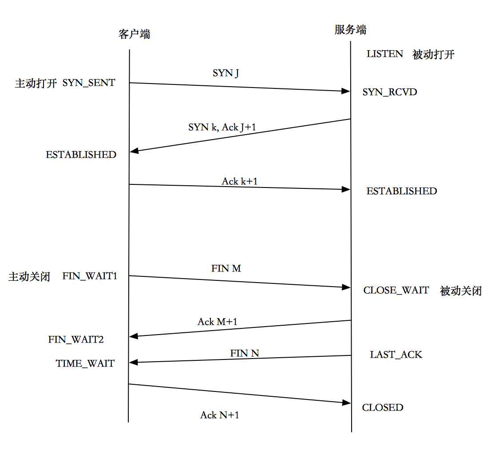

# ISSUE: CLOSE_WAIT

### 一、四次挥手

CLOSE_WAIT是四次挥手过程中的状态，只出现在被动关闭端,挥手过程如图所示：

*参考：[四次挥手过程][1]*

理解要点：

+ TCP是全双工模式，即发送数据的同时也能接收数据。
+ TCP连接的两端均可主动发起关闭请求。

### 二、CLOSE_WAIT问题

#### 为什么会产生CLOSE_WAIT?

CLOSE_WAIT状态维持的时间非常短，甚至捕捉不到。出现CLOSE_WAIT本身是正常现象，但如果有大量的进程处于CLOSE_WAIT，则说明出问题了，产生的原因有：

1. 主动关闭端因为超时时间太短（可能是没收到第二次或第三次挥手消息），断开了socket连接。被动端的ACK或FIN（第二次或第三次挥手）因为socket断开而无法发送，导致一直处于CLOSE_WAIT。
2. 被动端在发送ACK后（第二次挥手），自身的程序没有结束（陷入循环、程序请求别处资源而处于无限等待状态），也就无法发送FIN（第三次挥手）。

#### 如何分析CLOSE_WAIT现象?

*相关分析参考：*

+ *[探索服务端CLOSE_WAIT的原因--负载均衡的连接超时][2]*
+ *[HttpClient使用后没有close导致socket无法关闭][3]*
+ *[程序中请求cookie的微服务使用http没有关闭导致CLOSE_WAIT][4]*

综合上述三篇文章，可以使用`netstat -anlp|grep "CLOSE_WAIT"`，获知pid，源主机、目标主机、Recv-Q、Send-Q、State，通过这些值进行综合分析。

#### 如何解决?

+ 检查程序

  程序处于死循环，在异步请求第三方资源而没有关闭Http连接或没有设置timeout而无限等待，都会阻碍TCP连接的关闭。需要检查循环是否跳出，Http连接是否调用close，Http请求是否设置timeout。

+ 服务端的KeepAlive

  主动关闭端超时时间过短，也可以理解为被动关闭端响应时间太长。主动端丢下被动端跑路，被动端带着CLOSE_WAIT，最后生活不能自理，最简单粗暴的办法是kill掉处于CLOSE_WAIT的PID。但为了程序猿能安心过节，就需要让程序自力更生。除了写脚本定时清理进程,更优雅的方式是设置合适的KeepAlive。

  gunicorn配置KeepAlive：设置参数`keepalive`，官方推荐1-5s，如果前面有负载均衡，则要比负载均衡超时时间稍微长一点。

  linux配置KeepAlive：在*/proc/sys/net/ipv4/*路径下，编辑三个文件：tcp_keepalive_time（TCP连接的保活时间）、tcp_keepalive_intvl（保活侦测包发送间隔）、tcp_keepalive_probes（侦测包发送总数）。*[配置参考][5]*

[从问题看本质: 研究TCP close_wait的内幕][6]在多个平台模拟四次挥手过程，解决CLOSE_WAIT的思路同样是设置keepalive，另外还提到，应该让客户端先关闭socket，使TIME_WAIT出现在客户端，缓解服务器的资源紧张问题。

### 三、TIME_WAIT问题

[1]: https://blog.csdn.net/O9A0MA/article/details/90731748 "四次挥手和2MSL的原因"
[2]: https://mp.weixin.qq.com/s?__biz=MzI4MjA4ODU0Ng==&mid=402163560&idx=1&sn=5269044286ce1d142cca1b5fed3efab1&3rd=MzA3MDU4NTYzMw==&scene=6#rd "探索服务端CLOSE_WAIT的原因--负载均衡的连接超时"
[3]: https://mrdear.cn/2018/05/03/运维/linux-tcp_close_wait/ "HttpClient不调用close问题和TIME_WAIT分析"
[4]: https://www.jianshu.com/p/83bbeb33ed20 "程序中请求cookie的微服务使用http没有关闭导致CLOSE_WAIT"
[5]: https://blog.csdn.net/zhangge3663/article/details/88714037 "Tcp Keepalive和HTTP Keepalive详解"
[6]: https://www.cnblogs.com/zengkefu/p/5655016.html "不同平台探究CLOSE_WAIT问题"